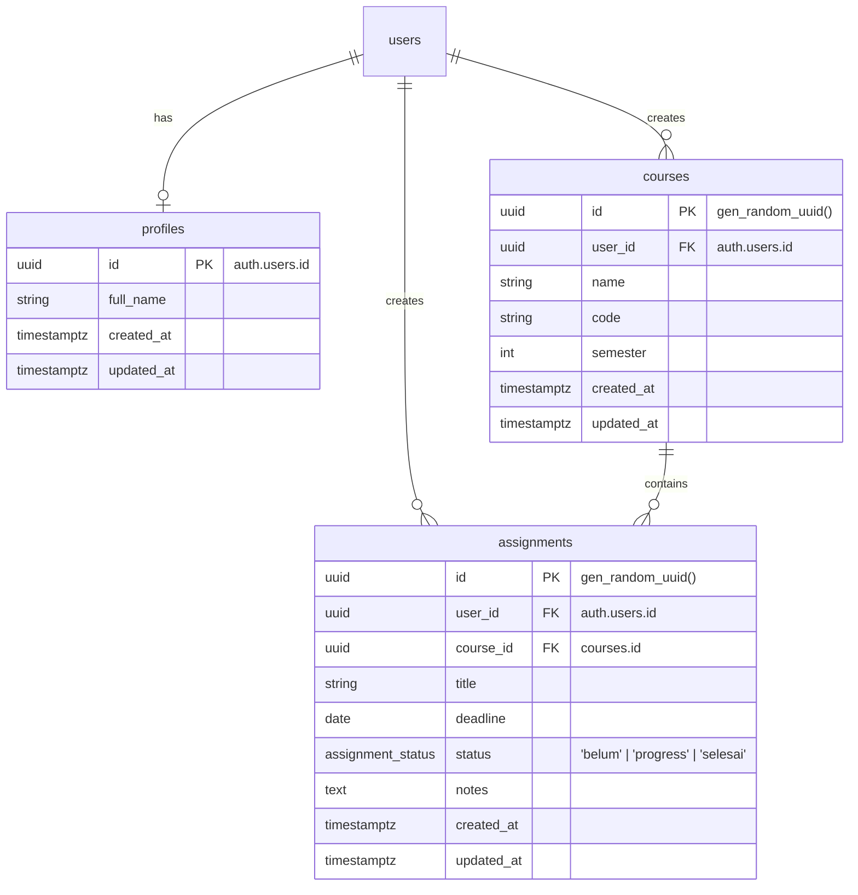

# 🎓 Akademik: Course & Assignment Management App

[](https://react.dev/)
[](https://www.typescriptlang.org/)
[](https://vite.dev/)
[](https://tailwindcss.com/)
[](https://supabase.com/)

Aplikasi web modern berbasis Cloud untuk manajemen mata kuliah dan tugas (assignments) mahasiswa. Didesain secara premium, responsif, dan dinamis untuk mempermudah pelacakan deadline perkuliahan agar mahasiswa dapat mengatur waktu belajar dengan lebih optimal.

> 📝 **Proyek Tugas Besar Kelompok 2 - Mata Kuliah Rekayasa Perangkat Lunak**

---

## ✨ Fitur Utama

Aplikasi **Akademik** dilengkapi dengan berbagai fitur unggulan untuk menunjang produktivitas akademik Anda:

- 📊 **Dashboard Interaktif**:
  - Ringkasan total mata kuliah, total tugas, tugas yang selesai, serta statistik tugas dengan tenggat waktu mendekat (≤ 3 hari) secara *real-time*.
  - Daftar tugas terdekat yang belum selesai agar Anda tidak melewatkan tenggat waktu.
- 📚 **Manajemen Mata Kuliah**:
  - Menambahkan, mengedit, dan menghapus data mata kuliah.
  - Filter mata kuliah berdasarkan semester dengan pencarian dinamis (kode atau nama mata kuliah).
  - Halaman detail mata kuliah yang menampilkan semua tugas khusus untuk mata kuliah tersebut.
- 📋 **Pelacakan Assignment & Status**:
  - Mengelola tugas dengan detail judul, catatan/instruksi, mata kuliah terkait, dan tanggal tenggat waktu (deadline).
  - Status tugas yang dinamis: 🔴 *Belum*, 🟡 *Progress*, dan 🟢 *Selesai*.
  - Indikator urgensi deadline otomatis (berwarna merah jika sisa waktu mendekat).
- 🔐 **Autentikasi & Database Cloud**:
  - Registrasi dan login aman yang didukung oleh **Supabase Auth**.
  - Isolasi data per-pengguna menggunakan kebijakan keamanan tingkat baris (**Row Level Security / RLS**) di database PostgreSQL.
  - Data Anda aman dan tersimpan di cloud secara *real-time*.
- ⚙️ **Pengaturan Profil & Manajemen Data**:
  - Kustomisasi nama profil dan email pengguna.
  - Opsi reset data aplikasi untuk mengosongkan semua mata kuliah dan tugas jika ingin memulai semester baru.

---

## 🛠️ Tech Stack & Arsitektur

Aplikasi ini dibangun menggunakan kombinasi teknologi modern demi performa, keamanan, dan pengalaman pengguna terbaik:

| Teknologi | Fungsi | Deskripsi |
| :--- | :--- | :--- |
| **React 19** | Library UI | Library UI JavaScript terpopuler dengan React Hooks terbaru untuk reaktivitas state. |
| **TypeScript** | Bahasa Pemrograman | Menyediakan tipe data statis demi kode yang lebih aman, terstruktur, dan minim bug. |
| **TanStack Start** | Framework / Router | Solusi routing premium berbasis file (`@tanstack/react-router`) untuk performa rendering optimal. |
| **Tailwind CSS v4** | Sistem Styling | Framework CSS utilitas terbaru untuk kustomisasi UI premium, responsif, dan beranimasi mulus. |
| **Supabase** | Backend & Database | Solusi Backend-as-a-Service menggunakan PostgreSQL, autentikasi user, dan sinkronisasi real-time. |
| **Lucide React** | Paket Ikon | Set ikon modern dan minimalis yang mempercantik tampilan antarmuka visual. |
| **Sonner** | Notifikasi | Toast notification yang elegan untuk memberi feedback instan pada setiap aksi pengguna. |

---

## 💾 Struktur Database (ERD)

Database aplikasi ini dirancang secara terstruktur di PostgreSQL melalui **Supabase**. Keamanan data dijaga menggunakan **Row Level Security (RLS)**, memastikan setiap mahasiswa hanya bisa mengakses data miliknya sendiri.



---

## 🚀 Panduan Instalasi & Pengembangan Lokal

Ikuti langkah-langkah berikut untuk menjalankan proyek ini di komputer Anda:

### 1. Prasyarat
Pastikan Anda sudah menginstal:
* [Node.js](https://nodejs.org/) (versi LTS terbaru yang direkomendasikan)
* Pengelola paket seperti `npm` atau `bun` (aplikasi ini terkonfigurasi dengan optimal menggunakan `bun`).

### 2. Kloning Repositori
```bash
git clone https://github.com/RayhanCQ/assignment-master-app.git
cd assignment-master-app/assignment-master-app-main
```

### 3. Instal Dependensi
Gunakan `bun` atau `npm` untuk menginstal seluruh dependensi yang diperlukan:
```bash
# Menggunakan Bun (Direkomendasikan)
bun install

# Atau menggunakan NPM
npm install
```

### 4. Konfigurasi Environment Variables
Buat berkas bernama `.env` di direktori utama proyek, lalu tambahkan kredensial Supabase Anda:
```env
VITE_SUPABASE_URL=https://<project-id>.supabase.co
VITE_SUPABASE_PUBLISHABLE_KEY=<your-publishable-key>
```
*(Catatan: Anda dapat menyalin isi dari berkas `.env.example` yang sudah disediakan jika ada)*

### 5. Jalankan Server Pengembangan
Jalankan perintah berikut untuk mengaktifkan server lokal:
```bash
# Menggunakan Bun
bun run dev

# Atau menggunakan NPM
npm run dev
```
Setelah server berjalan, buka peramban Anda dan akses **`http://localhost:3000`** atau alamat port yang tertera pada terminal.

### 6. Build untuk Produksi
Untuk melakukan kompilasi proyek menjadi berkas siap rilis di server produksi:
```bash
bun run build
# atau
npm run build
```

---

## 📂 Struktur Folder Proyek

```text
assignment-master-app-main/
├── .lovable/               # Konfigurasi deploy Lovable
├── public/                 # Aset statis publik (ikon, gambar, logo)
├── src/
│   ├── components/         # Komponen UI Reusable (Sidebar, Dialogs, Badges)
│   │   └── ui/             # Komponen visual dasar (shadcn/ui - Button, Card, dll.)
│   ├── hooks/              # Custom React Hooks
│   ├── integrations/       # Integrasi pihak ketiga (Klien Supabase)
│   ├── lib/                # Helper utilities & Store State Manajemen (store.ts)
│   ├── routes/             # Halaman & Konfigurasi Routing (TanStack Router)
│   │   ├── __root.tsx      # Komponen layout utama & navigasi
│   │   ├── index.tsx       # Halaman Dashboard
│   │   ├── courses.index.tsx # Halaman Daftar Mata Kuliah
│   │   ├── assignments.index.tsx # Halaman Daftar Tugas Aktif
│   │   └── ...
│   ├── router.tsx          # Inisialisasi router
│   ├── server.ts           # Entrypoint server (TanStack Start)
│   ├── start.ts            # Entrypoint client
│   └── styles.css          # Integrasi Tailwind CSS v4 & custom styles
├── supabase/
│   ├── migrations/         # Berkas migrasi database SQL (tabel, RLS, triggers)
│   └── config.toml         # Konfigurasi Supabase lokal
├── tsconfig.json           # Konfigurasi TypeScript compiler
└── vite.config.ts          # Konfigurasi Vite bundler
```

---

## 👥 Kontributor Proyek (Kelompok 2)

Kami sangat menyambut kontribusi untuk pengembangan aplikasi ini! Berikut adalah tim pengembang dari **Kelompok 2 Mata Kuliah Rekayasa Perangkat Lunak**:

| No | Nama | Peran | GitHub |
| :--- | :--- | :--- | :--- |
| **1** | **[Tulis Nama Anda Di Sini]** | Lead Developer & UI Designer | [](https://github.com) |
| 2 | Anggota Kelompok 2 | Backend Developer | [](https://github.com) |
| 3 | Anggota Kelompok 2 | Quality Assurance & Tester | [](https://github.com) |

### 💡 Cara Masuk Sebagai Contributor GitHub:
Jika Anda ingin nama Anda tercatat dalam riwayat kontribusi repositori GitHub dan muncul sebagai contributor aktif:
1. **Fork** repositori ini ke akun GitHub Anda.
2. Buat branch baru untuk fitur atau perubahan Anda: `git checkout -b fitur-keren-saya`.
3. Edit berkas `README.md` pada tabel kontributor di atas, ganti **`[Tulis Nama Anda Di Sini]`** dan link profil GitHub Anda dengan informasi asli Anda.
4. Lakukan commit pada perubahan tersebut:
   ```bash
   git add README.md
   git commit -m "docs: tambahkan nama mahasiswa ke daftar kontributor README"
   ```
5. Push branch Anda ke GitHub fork: `git push origin fitur-keren-saya`.
6. Buat **Pull Request (PR)** ke repositori utama. Setelah PR disetujui dan di-*merge*, Anda akan secara otomatis terdaftar sebagai salah satu **Contributor resmi** proyek ini di GitHub! 🚀
